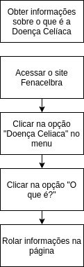

## Análise de tarefas

### Conceito:

Processo de analisar e articular a tarefa que os usuários querem ou devem desempenhar através do uso do produto.

Análise de como uma tarefa é realizada, incluindo uma descrição detalhada tanto de atividades físicas como mentais, duração da tarefa, frequência da tarefa, alocação da tarefa, complexidade da tarefa, condições ambientais, vestimenta e equipamento necessários, e qualquer outro fator envolvido ou requisitado por uma ou mais pessoas para realizar uma dada tarefa.

Uma análise de tarefa decompõe uma tarefa complexa em seus componentes, que são seus conhecimentos procedimentais e declarativos.

Descrição detalhada daquilo que uma pessoa competente faz ou deve fazer quando executa uma tarefa.

Pode ser usada com diversos objetivos, tais como projetar, avaliar, automatizar, possuindo então, diversos níveis de abstração.

Usado nas áreas de treinamento, seleção de pessoal, design instrucional, IHC etc.

### Análise de Tarefas Procedimental:

- Uma análise de tarefa procedimental é desenvolvida linearmente e sequencialmente, passo-a-passo.
- Tem um fluxo direcional.
- Tem um começo e um fim.
- Foca no processo.
- É representada através de fluxogramas
- Quais são os passos físicos e /ou mentais que a pessoa tem que atravessar para completar a tarefa?

Um exemplo de acesso para obter informações sobre o que é a Doença Celíaca.

1. Acesse o Site;
2. Clicar na opção "Doença Celíaca" no menu;
3. Clicar na opção "O que é?" do submenu;
4. Rolar informações na página;

### Aspectos analisados das Tarefas:

- Processo da tarefa
- Frequência da tarefa
- Importância de treinamento (aprendizado da tarefa)
- Dificuldade da tarefa
- Importância da tarefa
- Duração da tarefa
- Custos da tarefa
- Consequências da tarefa
- Contexto da tarefa
- Estrutura da tarefa
- Segurança / prevenção
- Facilidade de aprendizagem
- Latência (tempo de reação)

## Referências

BARBOSA, SILVA. Planejamento da Avaliação de IHC, Capítulo 4. 2010. 26 slides. Material apresentado para a disciplina de Interacão Humano Computador no curso de Engenharia de Software da UnB, FGA.

## Versionamento

| Data       | Versão | Descrição                                           | Autor             |
| :--------- | :----- | :-------------------------------------------------- | :---------------- |
| 14/10/2019 | 1.0    | Criação do documento          | Marcos Vinícius   |
| 14/10/2019 | 1.1    | Adicionando tópico de análise de tarefas            | Marcos Vinícius   |
| 16/10/2019 | 1.2    | Ajustes na organização da documentação | Nathalia Lorena     |
| 18/11/2019 | 1.3    | Ajustes e refatoração da tarefa analisada | Nathalia Lorena     |
| 25/11/2019 | 1.4    | Ajustando indentação e adicionando versionamento e referências | Débora Vilela     |