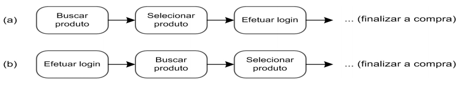
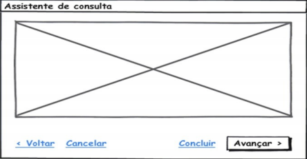
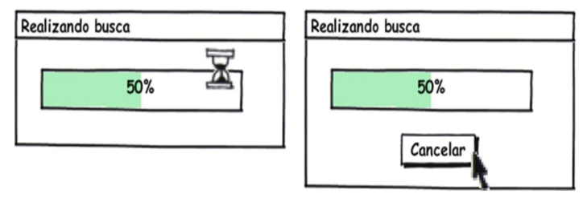
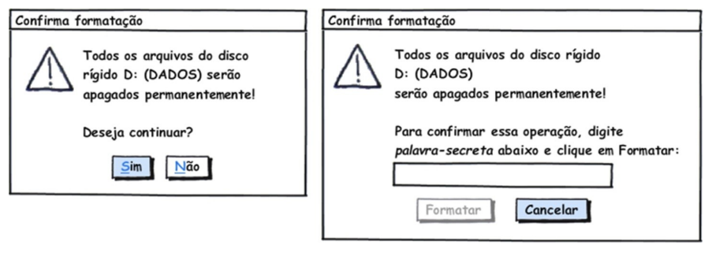
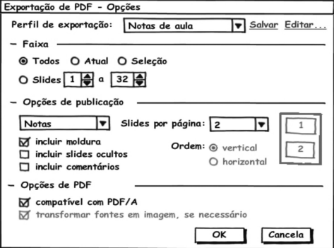
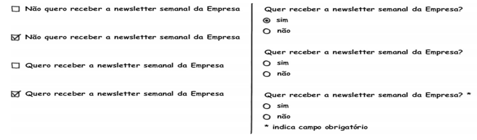
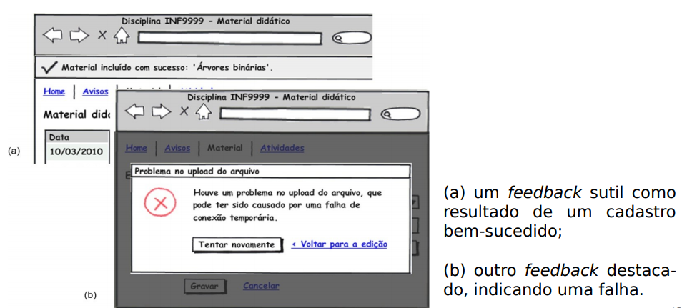
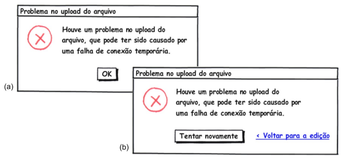
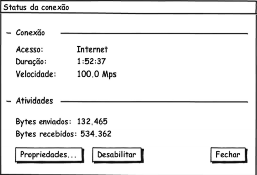

# Princípios e Diretrizes Gerais do Design

Trata-se da necessidade de projetarmos um sistema utilizando um modelo conceitual que o usuário possa aprender rapidamente e sem dificuldades. Este modelo conceitual deve auxiliar a interpretar o relacionamento entre as ações e relações apresentadas pelo sistema e o conhecimento no mundo. O site FENACELBRA não contempla grande parte desses princípios e diretrizes como veremos abaixo.

Abaixo estão alguns princípios e diretrizes comumente utilizados em um modelo conceitual:

## 1. Correspondência com a expectativa dos usuários

- 
Explorar os mapeamentos naturais, seja entre as variáveis mentais e as físicas, seja entre as tarefas e os controles utilizados para manipular essas variáveis no mundo real e no sistema projetado:

- 
Por exemplo, o sistema deve permitir que o usuário encontre o produto desejado antes de se identificar, como ele costuma fazer em lojas físicas:

- 
Estruturar o diálogo de forma a seguir uma linha de raciocínio e fornecer um fechamento;
- Seguir as convenções do mundo real, fazendo com que a informação apareça em uma ordem natural e lógica.

**Observações:** O FENACELBRA possui um menu que se sobrepõe às informações do site, impossibilitando o usuário de completar diversas tarefas, dessa forma, não corresponde com a expectativa dos usuários na maioria dos casos.

## 2. Simplicidade nas estruturas das tarefas

- 
Simplificar a estrutura das tarefas, reduzindo a quantidade de planejamento e resolução de problemas que elas requerem;

- 
Para simplificar a estrutura de tarefas, os designers podem seguir quatro abordagens tecnológicas:

    1. Manter a tarefa a mesma, mas fornecendo diversas formas de apoio para que o
    usuários consigam aprender a realizar a tarefa;
    2. Usar tecnologia para tornar visível o que seria invisível, melhorando o feedback
    e a capacidade do usuário se manter no controle da tarefa;
    3. Automatizar a tarefa, mantendo-a igual;
    4. Modificar a natureza da tarefa; 

**Observações:** O FENACELBRA possui um menu que se sobrepõe às informações do site, impossibilita que seja fácil realizar tarefas no site e também não oferece fluxos alternativos para a realização da mesma tarefa, dessa forma, observa-se que o site não possui estruturas simples de usar.

## 3. Equilíbrio entre controle e liberdade do usuário

- 
Mantenha o usuário no controle;
- 
Explore o poder das restrições, tanto naturais como artificiais, e projetar restrições para que o usuário sinta como se houvesse apenas uma coisa possível a fazer a coisa “certa”;

- 
Usuários não devem ficar presos num caminho de interação único para realizar uma atividade;

- 
Forneça aos usuários uma “saída” clara e rápida, mas deve ser mais fácil se manter “no caminho” do que sair dele inadvertidamente.

- 
Permita que o usuário cancele, desfaça e refaça suas ações. Isso facilita o aprendizado por exploração

- 
Quando uma operação considerada perigosa não puder ser desfeita,devemos projetar medidas de segurança para que ela não seja acionada incidentalmente;

- 
O sistema não deve forçar o usuário a escolher o tempo todo uma quantidade enorme de opções para prosseguir rumo ao objetivo;

- 
Escolha bons valores padrão (defaults) para quando não for necessário incomodar o usuário.

**Observações:** O site apresenta graves problemas para a realização de tarefas simples como saber mais sobre a Doença Celíaca, prejudicando a experiência do usuário, não possibilitando caminhos alternativos para realizar uma tarefa, o usuário não tem liberdade e nem controle sobre o site.

## 4. Consistência e padronização

- 
Padronize as ações, os resultados das ações, o layout dos diálogos e as visualizações de informação:

    
    1. 
Por exemplo: ações semelhantes devem funcionar de modo semelhante;

- 
Os usuários não devem ter de se perguntar se palavras, situações ou ações diferentes significam a mesma coisa:

    1. 
Por exemplo: utilizar rótulos Salvar e Gravar indiscriminadamente em um mesmo sistema pode confundir o usuário;

- 
A mesma terminologia deve ser utilizada em perguntas, menus e sistemas de ajuda.

**Observações:** O site não segue um layout de informações padronizado, as informações ficam "quebradas".
## 5. Promoção da eficiência do usuário

- 
Mantenha o usuário ocupado, ou seja, os processamentos demorados não devem impedir o usuário de realizar outras atividades no sistema, deixando o processos rodando em background;

- 
Proteja o trabalho dos usuários, ou seja, o sistema deve evitar perder ou deixar de salvar algo que o usuário já fez;

- 
Forneça atalhos e aceleradores, como teclas de atalho e botões na barra de ferramenta.

**Observações:** O usuário perde bastante tempo no site apenas tentando clicar no menu e em itens, dessa forma, o uso do site não promove eficiência ao usuário.

## 6. Antecipação das necessidades do usuário

- 
Tente prever o que o usuário quer e precisa, para fornecer todas as informações e ferramentas necessárias para cada passo do processo;

- 
Tome iniciativa e forneça informações adicionais úteis, em vez de apenas responder precisamente a pergunta que o usuário tiver feito:

Considere cada alternativa. Ela é eficiente? É neutra? Ou induz a uma determinada opção?

**Observações:** O site contempla informações adicionais bastante úteis, sem que o usário precise ficar procurando nas páginas, no entanto, devido o layout do site ficar com o menu sobreposto impossibilita o acesso a essas informações.
## 7. Visibilidade e reconhecimento

-  
designer deve tonar os objetos visíveis: abreviar os golfos de execução e avaliação;

- 
O estado do sistema, os objetos, as ações e as opções devem estar atualizados e facilmente perceptíveis;

- 
O usuário não deve ter de se lembrar de informações de uma parte da aplicação quando tiver passado para uma outra parte da aplicação;

- 
Quando o usuário realiza uma ação, o sistema deve mantê-lo informado sobre o que ocorreu ou está ocorrendo, através de feedback (resposta do sistema) adequado e no tempo certo.

- 
Em geral, as informações de status podem ser bem sutis;

- 
Para ações frequentes e com resultado esperado, a resposta pode ser sutil, mas para ações infrequentes e com grandes consequências, a resposta deve ser mais substancial;

 **Observações:** Grande parte dos objetos no site não são facilmente visíveis, o usuário não tem um feedback de todas as suas tarefas realizadas no site.

## 8. Conteúdo relevante e expressão adequada

- Projeto estético e minimalista;
- 
As mensagens de instrução e ajuda devem ser concisas e informativas sobre problemas que ocorrerem;

- 
Os rótulos de menus e botões devem ser claros e livres de ambiguidade;

- Certifique-se de que o texto também seja legível.

 **Observações:** Não há instruções informativas caso ocorram problemas na experiência do usuário, os botões não estão claros em todas as tarefas que é possível realizar.

## 9. Projeto para erros

- Deve ser fácil reverter as operações e difícil realizar ações irreversíveis;
- 
Ajudar aos usuários a reconhecerem, diagnosticarem e se recuperarem de erros, informando-lhe sobre o que ocorreu, as consequências disso e como reverter os resultados indesejados;

- 
Não coloque controles de funções utilizadas com frequência adjacentes a controles perigosos ou que raramente são utilizados;

    1. 
Exemplo: um botão de inspeção de Propriedades está posicionado bem próximo ao botão para Desabilitar a conexão de rede que, inclusive, efetua a operação sem pedir confirmação do usuário.

**Observações:** O site não conta com projeto para erros e também não ajuda os usuários a reconhecerem, diagnosticarem e recuperarem  erros, informando-lhe sobre o que ocorreu, as consequências disso e como reverter os resultados indesejados.

## Referências

BARBOSA, SILVA. Planejamento da Avaliação de IHC, Capítulo 8. 2010. 26 slides. Material apresentado para a disciplina de Interacão Humano Computador no curso de Engenharia de Software da UnB, FGA.

## Versionamento

| Data       | Versão | Descrição                              | Autor           |
| :--------- | :----- | :------------------------------------- | :-------------- |
| 14/10/2019 | 1.0    | Criação do documento                   | Nathalia Lorena |
| 14/10/2019 | 1.1    | Adicionando Princípios e Diretrizes    | Nathalia Lorena |
| 16/10/2019 | 1.2    | Ajustes na organização da documentação | Nathalia Lorena |
| 16/10/2019 | 1.3    | Adicionando mais tópicos no documento | Nathalia Lorena |
| 25/11/2019 | 1.4    | Ajustando indentação e adicionando versionamento e referências | Débora Vilela     |
| 25/11/2019 | 1.4    | Ajustando indentação e adicionando versionamento e referências | Débora Vilela     |