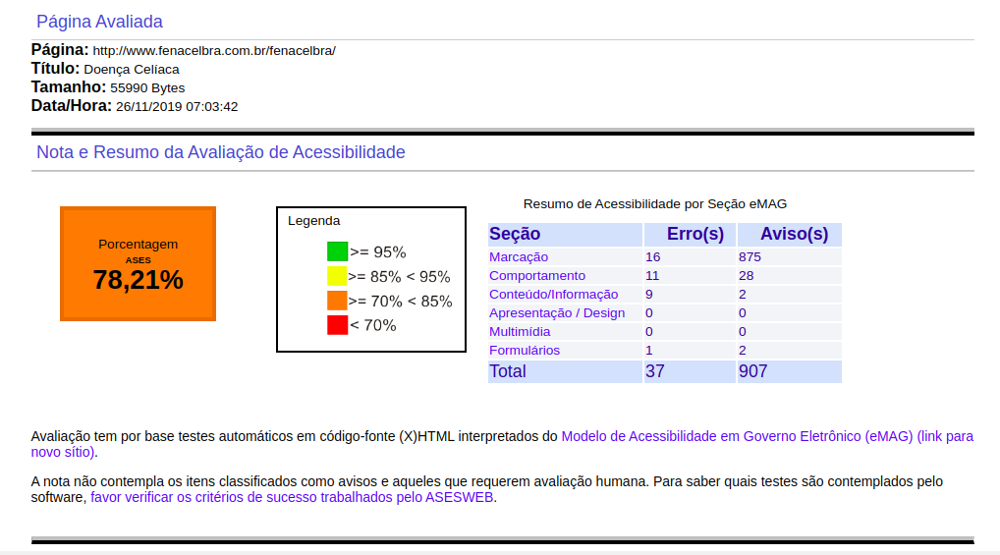
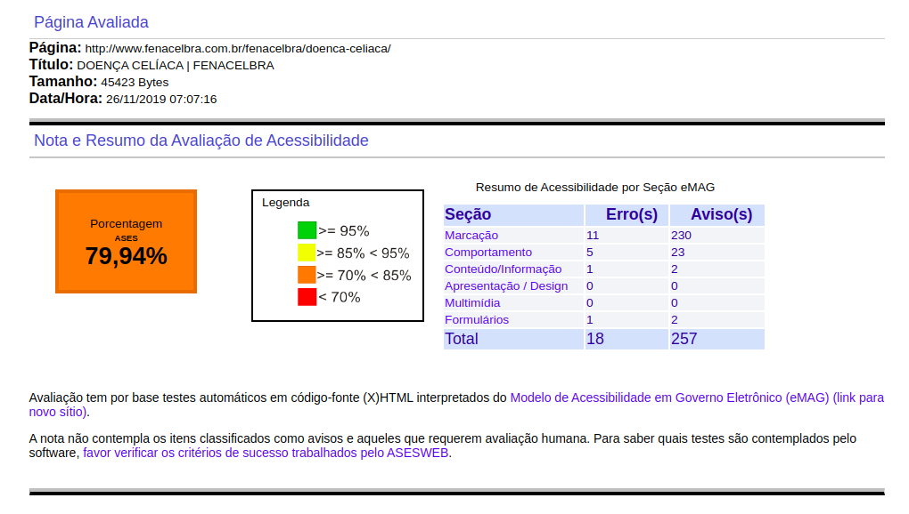
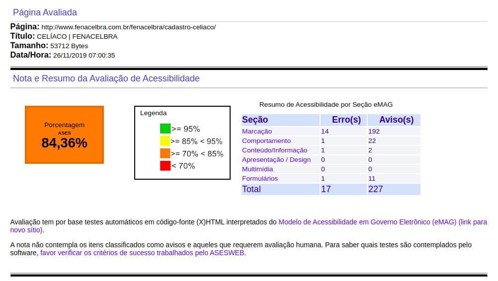

# Avaliação ASES

### Sobre o software

O Avaliador e Simulador de Acessibilidade em Sítios (ASES) é uma ferramenta que permite avaliar, simular e corrigir a acessibilidade de páginas, sítios e portais, sendo de grande valia para os desenvolvedores e publicadores de conteúdo.

### Objetivo

O ASES tem o propóstio de auxiliar a construção de sites que sejam acessíveis a qualquer pessoa, independente do seu tipo de deficiência e dispositivo de navegação.

### Metas

- Ser a primeira ferramenta a proporcionar a avaliação de acessiblidade de páginas web de acordo com as recomendações do Modelo de Acessibilidade em Governo Eletrônico (eMAG);
- Proporcionar que os cidadãos avaliem e pontuem a acessibilidade de páginas web de forma fácil e ágil;
- Ajudar na melhoria do cenário de acessibilidade em páginas do governo;
- Facilitar o acesso das pessoas com necessidades especiais às páginas do governo.

### Home

Esta avaliação pode ser consultada por [aqui](../assets/RelatorioHome.pdf)

#### Resultados

|Erros|Quantidade|
|:--:|:----:|
|Não respeita os padrões WEB |10|
|O código HTML está de forma desorganizada e sem com falta de semântica |3|
|O site não utiliza os níveis de cabeçalho corretamente|1|
|Não fornece âncoras para acesso direto à algum bloco de conteúdo |2|

### O que é Doença Celíaca?

Esta avaliação pode ser consultada por [aqui](../assets/RelatorioOquee.pdf)

#### Resultados

|Erros|Quantidade|
|:--:|:----:|
|Não respeita os padrões WEB |4
|O código HTML está de forma desorganizada e sem com falta de semântica |3
|O site não utiliza os níveis de cabeçalho corretamente|2
|Não fornece âncoras para acesso direto à algum bloco de conteúdo |2|

### Cadastro Celíaco

Esta avaliação pode ser consultada por [aqui](../assets/RelatorioCadastro.pdf)

#### Resultados

|Erros|Quantidade|
|:--:|:----:|
|Não respeita os padrões WEB |4
|O código HTML está de forma desorganizada e com falta de semântica |7
|O site não utiliza os níveis de cabeçalho corretamente|1
|Não fornece âncoras para acesso direto à algum bloco de conteúdo |2|

### Referência

[ASES](https://softwarepublico.gov.br/social/ases). Acesso em 25/11/2019.

### Versionamento

|Data|Versão|Descrição|Autor|
|:--:|:----:|:-------:|:---:|
|25/11/2019|1.0|Criação do documento|Marcos Vinicius|