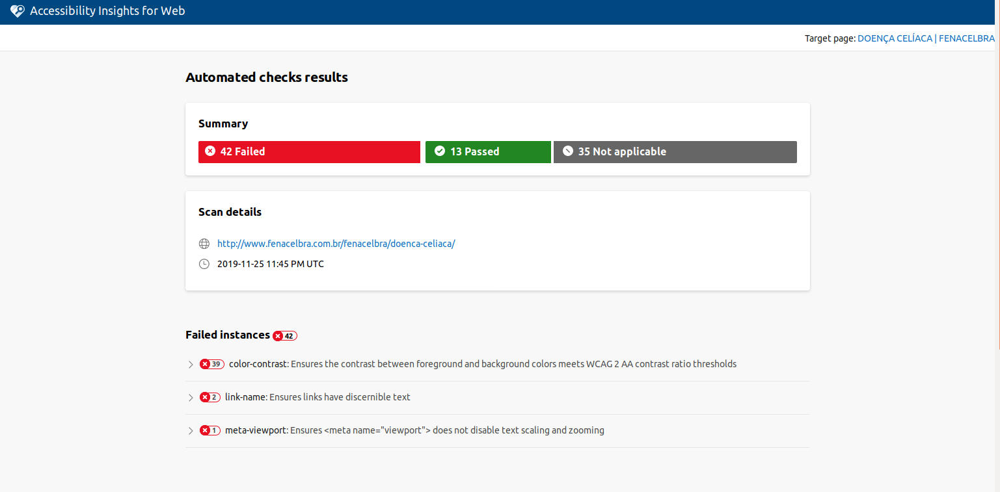
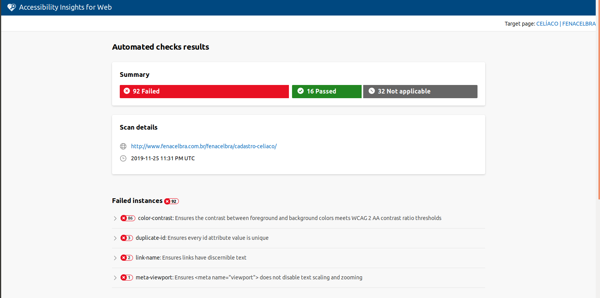

# Avaliação Padrão W3C

A avaliação do padrão W3C consiste em uma ferramenta automata para detecção de falhas e/ou aperfeiçoamento em sítios na web para se adequarem a um padrão de acessibilidade que abranja um grande número de usuários. 
Essa avaliação é feita por meio de um plugin que pode ser acessado por este [link](https://accessibilityinsights.io/docs/en/web/overview).

A avaliação foi feita em duas páginas tomadas como principais de acesso para os usuário da plataforma, sendo elas a tela de cadastro e a tela de "O que é doença Celíaca".

## O que é Doença Celíaca?

Esta avaliação pode ser consultada por [aqui](../assets/w3c_doencaceliaca.html)

## Cadastro Celíaco

Esta avaliação pode ser consultada por [aqui](../assets/w3c_cadastro.html)

|Data|Versão|Descrição|Autor|
|:--:|:----:|:-------:|:---:|
|25/11/2019|1.0|Criação do documento|Gabriel Tiveron|
|25/11/2019|1.1|Adição de referencia para documentos|Gabriel Tiveron|

### Referência

[Acessibility Insights](https://accessibilityinsights.io/docs/en/web/overview). Acesso em 25/11/2019.
