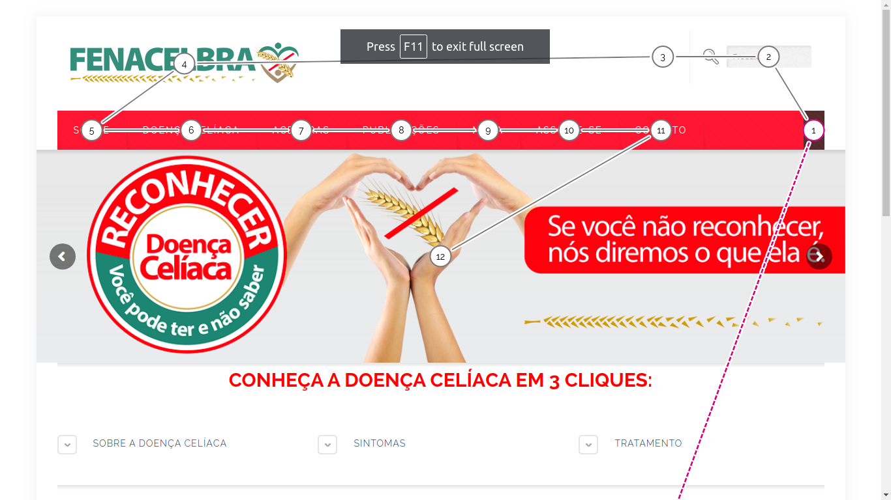
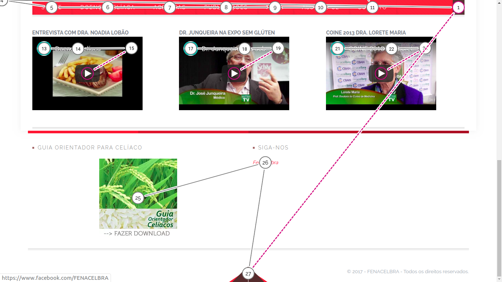
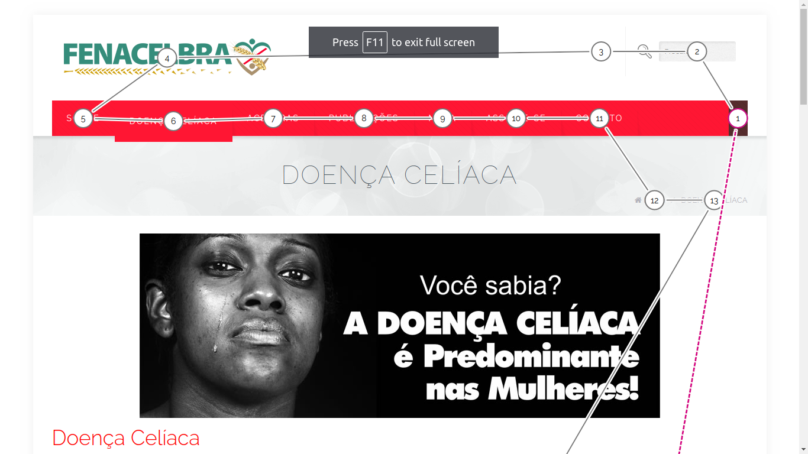
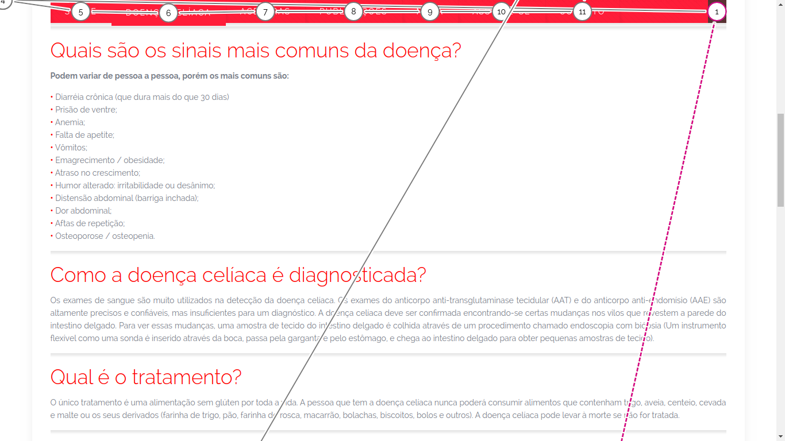
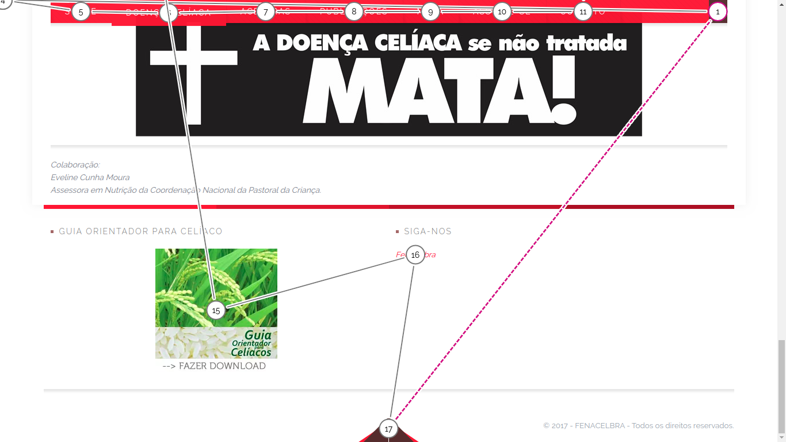
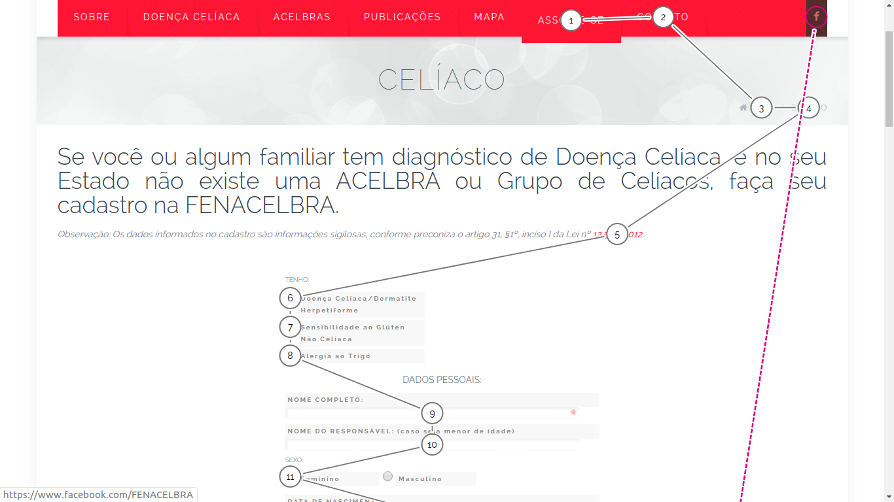
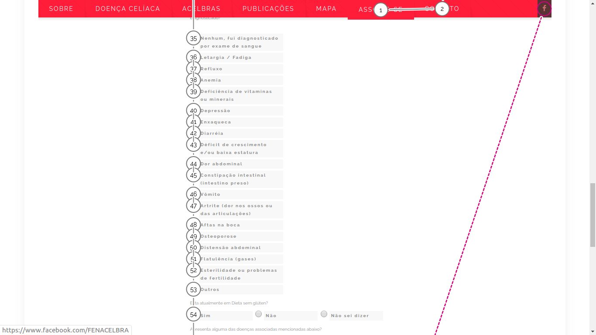
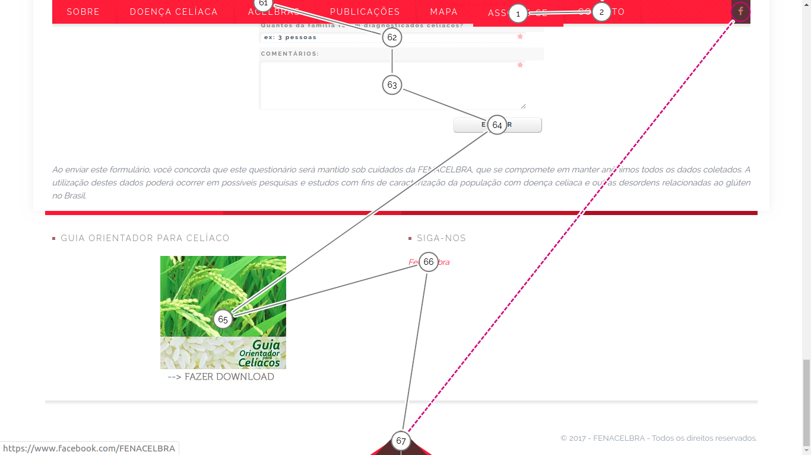

# Avaliação Padrão W3C

A avaliação do padrão W3C consiste em uma ferramenta automata para detecção de falhas e/ou aperfeiçoamento em sítios na web para se adequarem a um padrão de acessibilidade que abranja um grande número de usuários.

Essa avaliação é feita por meio de um plugin que pode ser acessado por este [link](https://accessibilityinsights.io/docs/en/web/overview)

A avaliação foi feita em duas páginas tomadas como principais de acesso para os usuário da plataforma, sendo elas a tela de cadastro e a tela de "O que é doença Celíaca".

## O que é Doença Celíaca?

Esta avaliação pode ser consultada por [aqui](../assets/w3c_doencaceliaca.html)

## Cadastro Celíaco

Esta avaliação pode ser consultada por [aqui](../assets/w3c_cadastro.html)

### TABSSTOPS

A acessibilidade do teclado é um dos aspectos mais importantes da acessibilidade da web. Muitos usuários com deficiências motoras confiam em um teclado. Usuários cegos também costumam usar um teclado para navegação. Algumas pessoas têm tremores que não permitem o controle muscular fino. Outros têm pouco ou nenhum uso de suas mãos. Algumas pessoas simplesmente não têm mãos, seja devido a um defeito de nascença, um acidente ou amputação. Além dos teclados tradicionais, alguns usuários podem usar teclados modificados ou outro hardware que imita a funcionalidade de um teclado.

### Problemas potenciais

Há muitas maneiras pelas quais uma página da Web pode apresentar dificuldades para usuários que dependem de um teclado para navegação. Abaixo estão alguns dos problemas mais comuns.

### Indicadores de foco

Um usuário do teclado normalmente usa a tecla Tab para navegar pelos elementos interativos em uma página da Web - links, botões, campos para inserir texto, etc. Quando um item tem "foco" no teclado, ele pode ser ativado ou manipulado com o teclado. Um usuário de teclado com visão precisa receber um indicador visual do elemento que atualmente possui o foco no teclado. Um indicador de foco básico é fornecido automaticamente pelo navegador da web e normalmente é mostrado como uma borda (chamada de estrutura de tópicos) ao redor do elemento focado.

Realizamos o teste que o plugin fornece para avaliarmos a situação da navegabilidade via teclado do site em 3 páginas Home, Doença Celíaca e Cadastro Celíaco.

#### Home

#### Doença Celíaca

#### Cadastro Celíaco

### Referência

[Acessibility Insights](https://accessibilityinsights.io/docs/en/web/overview). Acesso em 25/11/2019.

## Versionamento

|Data|Versão|Descrição|Autor|
|:--:|:----:|:-------:|:---:|
|25/11/2019|1.0|Criação do documento|Gabriel Tiveron|
|25/11/2019|1.1|Adição de referencia para documentos|Gabriel Tiveron|
| 25/11/2019 | 1.2    | Ajustando indentação e adicionando versionamento | Débora Vilela     |
| 25/11/2019 | 1.3    | Adicionando TabsStops | Marcos Vinícius Rodrigues     |

