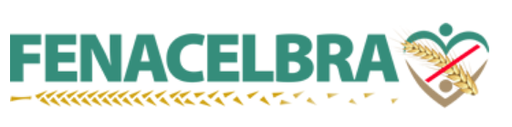

# Grupo 8 - Fenacelbra

## Sobre a Fenacelbra

A FENACELBRA é a voz nacional das Associações de Celíacos do Brasil e se dedica a melhorar a qualidade de vida das pessoas afetadas pela Doença Celíaca e Desordens relacionadas ao glúten. A plataforma pode ser acessada por portadores da Doença Celíaca, como também curiosos e voluntarios.

## Equipe

O grupo 8 é composto por 6 alunos da disciplina de Interação Humano Computador do 2º Semestre de 2019. Sendo eles:

| Nome                                   | Matrícula  | GitHub                                                    |
| -------------------------------------- | ---------- | --------------------------------------------------------- |
| Débora Vilela                          | 17/0008762 | [deborapvilela](https://github.com/deborapvilela)         |
| Gabriel Marques Tiveron                | 17/0103471 | [GabrielTiveron](https://github.com/GabrielTiveron)       |
| Marcelo Ferreira Magalhães Júnior      | 19/0047348 | [Marrcelo](https://github.com/Marrcelo)                   |
| Marcos Vinícius Rodrigues da Conceição | 17/0150747 | [marcos-mv](https://github.com/marcos-mv)                 |
| Nathalia Lorena Cardoso                | 14/0156909 | [Natilorens](https://github.com/Natilorens)               |
| Victor Levi Peixoto                    | 17/0115208 | [VictorLeviPeixoto](https://github.com/VictorLeviPeixoto) |

## Sobre a Escolha do software

O software foi decidido após uma análise em grupo e notou-se que o sistema possuía problemas graves.
Outros aplicativos e programas na votação: suap, Alura.

## Comunicação e ferramentas utilizadas

Utilizamos o Telegram como principal meio de comunicação entre os membros do grupo, por meio dele são definidos horários das reuniões presenciais e online, distribuição de tarefas em aberto, avisos, discussões acerca do andamento da disciplina e etc...
As reuniões online são feitas através da plataforma da Google Hangouts.

## Como trabalhamos

O grupo se reune por Hangouts após as aulas de exposição de conteúdo para discutir sobre a matéria e distribuir as tarefas, e das dinâmicas para melhorar os esboços e produzir a versão final que será entregada na apresentação. As reuniões são marcadas pelo Telegram com auxílio de tabelas de horários construídas no Google Docs.

## Referências

1. Site da [Fenacelbra](http://www.fenacelbra.com.br/) acesso em 06/09/2019

| Data       | Versão | Descrição                 | Autor             |
| :--------- | :----- | :------------------------ | :---------------- |
| 06/09/2019 | 1.0    | Criação da Home           | Marcos Vinícius   |
| 09/09/2019 | 1.1    | Edição e adição no Mkdocs | Marcelo Magalhães |
| 16/10/2019 | 1.2    | Ajustes na organização da documentação | Nathalia Lorena |