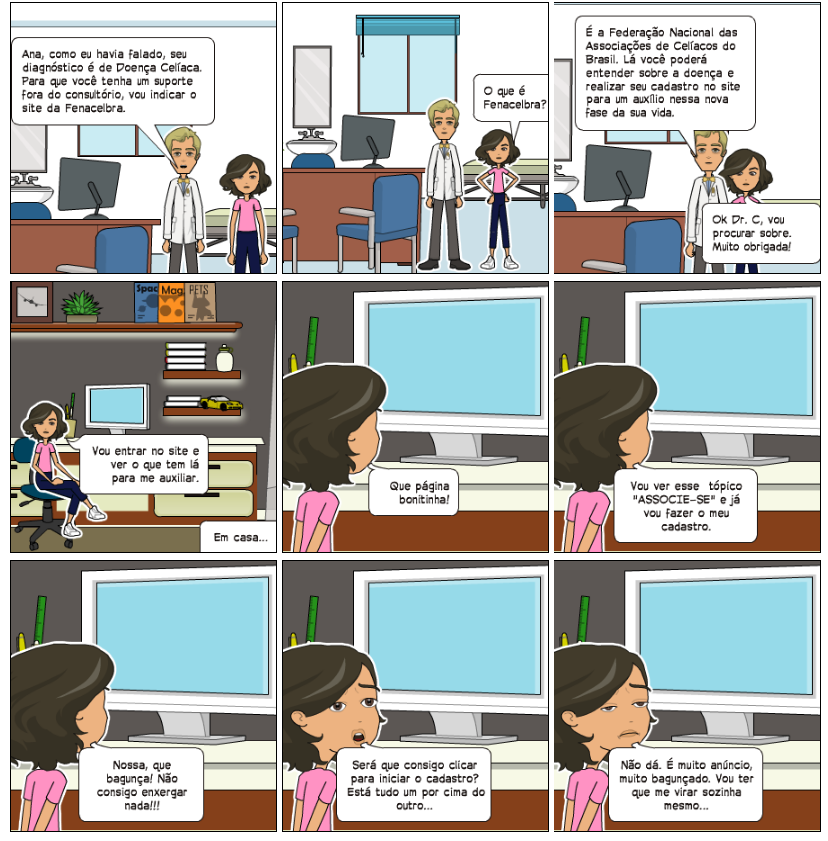
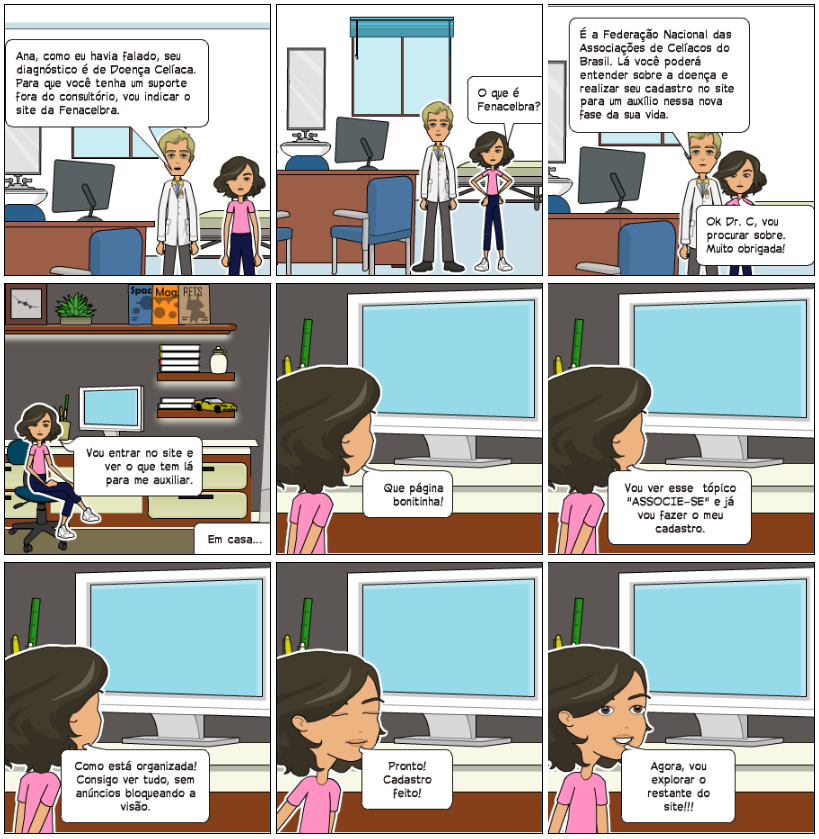

# Storyboards 

## Como é atualmente

## Como deveria ser

## Referências

[Site Fenacelbra](http://www.fenacelbra.com.br/fenacelbra/) . Acesso em: 25 de novembro de 2019.

BARBOSA, SILVA. Planejamento da Avaliação de IHC, Capítulo 8. 2010. 26 slides. Material apresentado para a disciplina de Interacão Humano Computador no curso de Engenharia de Software da UnB, FGA

## Versionamento

| Data       | Versão | Descrição                              | Autor           |
| :--------- | :----- | :------------------------------------- | :-------------- |
| 16/09/2019 | 1.0    | Criação do documento                   | Débora Vilela  |
| 25/11/2019 | 1.1    | Ajustando indentação e adicionando versionamento e referências | Débora Vilela     |