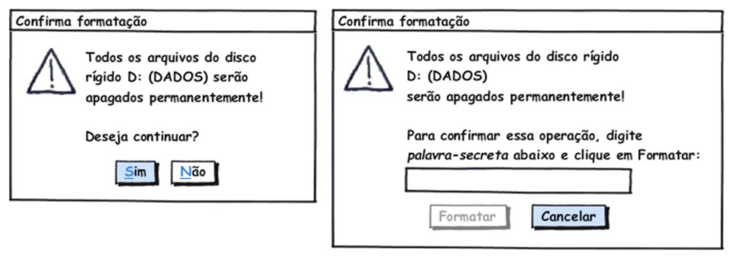
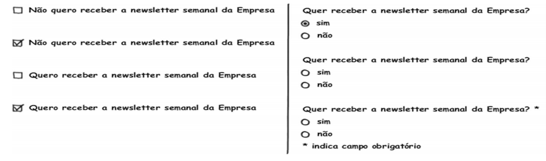

# Princípios e Diretrizes Gerais do Design

Trata-se da necessidade de projetarmos um sistema utilizando um modelo conceitual que o usuário possa aprender rapidamente e sem dificuldades. Este modelo conceitual deve auxiliar a interpretar o relacionamento entre as ações e relações apresentadas pelo sistema e o conhecimento no mundo.

Abaixo estão alguns princípios e diretrizes comumente utilizados:

## 1. Correspondência com a expectativa dos usuários

- Explorar os mapeamentos naturais, seja entre as variáveis mentais e as
físicas, seja entre as tarefas e os controles utilizados para manipular essas
variáveis no mundo real e no sistema projetado:

- Por exemplo, o sistema deve permitir que o usuário encontre o produto desejado
antes de se identificar, como ele costuma fazer em lojas físicas:

- Estruturar o diálogo de forma a seguir uma linha de raciocínio e fornecer um fechamento;
Seguir as convenções do mundo real, fazendo com que a informação apareça em uma
ordem natural e lógica.

## 2. Simplicidade nas estruturas das tarefas

- Simplificar a estrutura das tarefas, reduzindo a quantidade de
planejamento e resolução de problemas que elas requerem;

- Para simplificar a estrutura de tarefas, os designers podem seguir
quatro abordagens tecnológicas:

    1. Manter a tarefa a mesma, mas fornecendo diversas formas de apoio para que o
usuários consigam aprender a realizar a tarefa;
    2. Usar tecnologia para tornar visível o que seria invisível, melhorando o feedback
e a capacidade do usuário se manter no controle da tarefa;
    3. Automatizar a tarefa, mantendo-a igual;
Modificar a natureza da tarefa; 

## 3. Equilíbrio entre controle e liberdade do usuário

- Mantenha o usuário no controle;
Explore o poder das restrições, tanto naturais como artificiais, e
projetar restrições para que o usuário sinta como se houvesse
apenas uma coisa possível a fazer a coisa “certa”;
- Usuários não devem ficar presos num caminho de interação único
para realizar uma atividade;
- Forneça aos usuários uma “saída” clara e rápida, mas deve ser mais
fácil se manter “no caminho” do que sair dele inadvertidamente.

- Permita que o usuário cancele, desfaça e refaça suas ações. Isso
facilita o aprendizado por exploração

- Quando uma operação considerada perigosa não puder ser desfeita,
devemos projetar medidas de segurança para que ela não seja

acionada incidentalmente;
- O sistema não deve forçar o usuário a escolher o tempo todo uma quantidade
enorme de opções para prosseguir rumo ao objetivo;
- Escolha bons valores padrão (defaults) para quando não for necessário
incomodar o usuário.

## 4. Consistência e padronização

- Padronize as ações, os resultados das ações, o layout dos diálogos
e as visualizações de informação:
    1. Por exemplo: ações semelhantes devem funcionar de modo
semelhante;
- Os usuários não devem ter de se perguntar se palavras, situações ou
ações diferentes significam a mesma coisa:
    1. Por exemplo: utilizar rótulos Salvar e Gravar indiscriminadamente
em um mesmo sistema pode confundir o usuário;
- A mesma terminologia deve ser utilizada em perguntas, menus e
sistemas de ajuda.

## 5. Promoção da eficiência do usuário

- Mantenha o usuário ocupado, ou seja, os processamentos demorados não devem impedir o usuário de realizar outras atividades no sistema, deixando o processos rodando em background;
- Proteja o trabalho dos usuários, ou seja, o sistema deve evitar perder
ou deixar de salvar algo que o usuário já fez;
- Forneça atalhos e aceleradores, como teclas de atalho e botões na
barra de ferramenta.

## 6. Antecipação das necessidades do usuário

- Tente prever o que o usuário quer e precisa, para fornecer todas as
informações e ferramentas necessárias para cada passo do processo;
- Tome iniciativa e forneça informações adicionais úteis, em vez de
apenas responder precisamente a pergunta que o usuário tiver feito:

Considere cada alternativa. Ela é eficiente? É neutra? Ou induz a uma determinada
opção?

## 7. Visibilidade e reconhecimento

-  designer deve tonar os objetos visíveis: abreviar os golfos de execução e avaliação;
- O estado do sistema, os objetos, as ações e as opções devem estar
atualizados e facilmente perceptíveis;
- O usuário não deve ter de se lembrar de informações de uma parte
da aplicação quando tiver passado para uma outra parte da aplicação;
- Quando o usuário realiza uma ação, o sistema deve mantê-lo informado sobre o que ocorreu ou está ocorrendo, através de feedback
(resposta do sistema) adequado e no tempo certo.
- Em geral, as informações de status podem ser bem sutis;
- Para ações frequentes e com resultado esperado, a resposta pode
ser sutil, mas para ações infrequentes e com grandes consequências, a resposta deve ser mais substancial;

## 8. Conteúdo relevante e expressão adequada

- Projeto estético e minimalista;
- As mensagens de instrução e ajuda devem ser concisas e informativas sobre problemas que ocorrerem;
- Os rótulos de menus e botões devem ser claros e livres de ambiguidade;
- Certifique-se de que o texto também seja legível.

## 9. Projeto para erros

- Deve ser fácil reverter as operações e difícil realizar ações irreversíveis;
- Ajudar aos usuários a reconhecerem, diagnosticarem e se recuperarem de erros, informando-lhe sobre o que ocorreu, as consequências
disso e como reverter os resultados indesejados;

- Não coloque controles de funções utilizadas com frequência adjacentes a controles perigosos ou que raramente são utilizados;
    1. Exemplo: um botão de inspeção de Propriedades está posicionado bem próximo ao botão para Desabilitar a conexão de rede
que, inclusive, efetua a operação sem pedir confirmação do usuário.

## Referências

BARBOSA, SILVA. Planejamento da Avaliação de IHC, Capítulo 8. 2010. 26 slides. Material apresentado para a disciplina de Interacão Humano Computador no curso de Engenharia de Software da UnB, FGA.

| Data       | Versão | Descrição                              | Autor           |
| :--------- | :----- | :------------------------------------- | :-------------- |
| 14/10/2019 | 1.0    | Criação do documento                   | Nathalia Lorena |
| 14/10/2019 | 1.1    | Adicionando Princípios e Diretrizes    | Nathalia Lorena |
| 16/10/2019 | 1.2    | Ajustes na organização da documentação | Nathalia Lorena |
| 16/10/2019 | 1.3    | Adicionando mais tópicos no documento | Nathalia Lorena |
