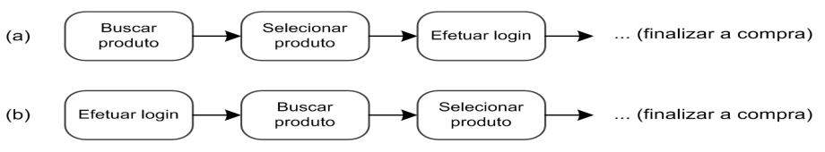

# Princípios e Diretrizes Gerais do Design

Trata-se da necessidade de projetarmos um sistema utilizando um modelo conceitual que o usuário possa aprender rapidamente e sem dificuldades. Este modelo conceitual deve auxiliar a interpretar o relacionamento entre as ações e relações apresentadas pelo sistema e o conhecimento no mundo.

Abaixo estão alguns princípios e diretrizes comumente utilizados:

## 1. Correspondência com a expectativa dos usuários;

- Explorar os mapeamentos naturais, seja entre as variáveis mentais e as
físicas, seja entre as tarefas e os controles utilizados para manipular essas
variáveis no mundo real e no sistema projetado:

- Por exemplo, o sistema deve permitir que o usuário encontre o produto desejado
antes de se identificar, como ele costuma fazer em lojas físicas:

- Estruturar o diálogo de forma a seguir uma linha de raciocínio e fornecer um fechamento;
Seguir as convenções do mundo real, fazendo com que a informação apareça em uma
ordem natural e lógica.

2. Simplicidade nas estruturas das tarefas;
3. Equilíbrio entre controle e liberdade do usuário;
4. Consistência e padronização;
5. Promoção da eficiência do usuário;
6. Antecipação das necessidades do usuário;
7. Visibilidade e reconhecimento;
8. Conteúdo relevante e expressão adequada;
9. Projeto para erros.

| Data       | Versão | Descrição                              | Autor           |
| :--------- | :----- | :------------------------------------- | :-------------- |
| 14/10/2019 | 1.0    | Criação do documento                   | Nathalia Lorena |
| 14/10/2019 | 1.1    | Adicionando Princípios e Diretrizes    | Nathalia Lorena |
| 16/10/2019 | 1.2    | Ajustes na organização da documentação | Nathalia Lorena |
