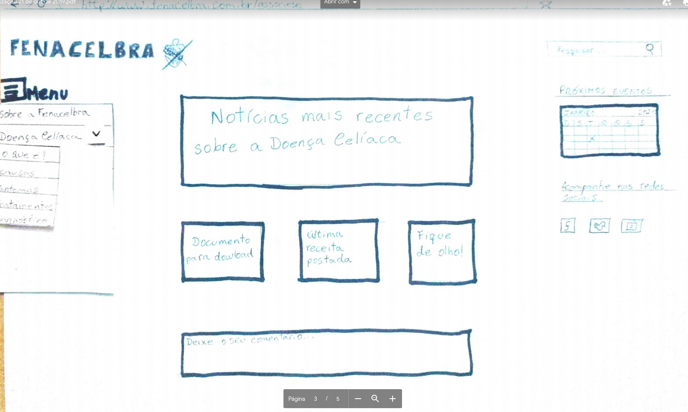
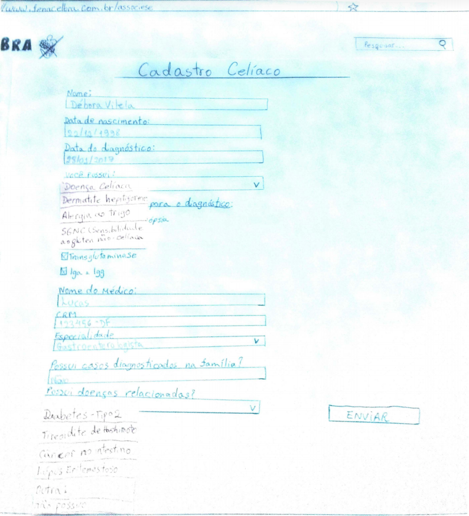

# Protótipo de papel

Este documento consiste na elaboração de um protótipo de baixa fidelidade de papel que registra como deveria ser funcionamento do site FENACELBRA. Com base em relatos de uma persona, foi possível afirmar que a tarefa foco no site é realizar o cadastro de usuário, sendo essa persona um celíaco recém diagnosticado a procura de informações, não funciona bem, e deixa o usuário frustrado. Dessa forma, a equipe elaborou um fluxo ideal através do protótipo de papel de como deveria ser o funcionamento do cadastro para os stakeholders.

## Página inicial e menu

## Página de cadastro

No site atualmente não é possível realizar um cadastro eficiente, pois as informações do menu de opções se sobrepõem quando somos direcionados à página de cadastro.

## Videos

Nos vídeos é possível verificar como deveria ser o funcionamento do site FENACELBRA, como seria o fluxo ideal para realizar um cadastro na plataforma através de um protótipo de baixa fidelidade.

<iframe src="https://player.vimeo.com/video/367932289" width="640" height="360" frameborder="0" allowfullscreen></iframe>

<iframe src="https://player.vimeo.com/video/367932458" width="640" height="360" frameborder="0" allowfullscreen></iframe>

### *Versão refatorada do protótipo de Papel*

<iframe src="https://player.vimeo.com/video/374132341" width="640" height="480" frameborder="0" allow="autoplay; fullscreen" allowfullscreen></iframe>

## Resultados da avaliação do protótipo de baixa fidelidade e propostas de melhorias

| Dificuldades encontradas     | Propostas de melhorias para o protótipo | 
| :--------- | :----- | 
|Dificuldades em encontrar a opção de cadastro|  Corrigir posição do botão de Menu  |
|Itens do formulário atrapalham a visualização das demais informações, pois ficam sobrepostos|  Corrigir a posição do Menu  | 
| o Usuário não foi informado sobre os campos obrigatórios do formulário |  Informar com um '*' os campos obrigatórios a serem preenchidos  | 
| Os tópicos do Menu principal não são ordenados de forma coerente |   Proporcionar ordenação mais coesa do Menu  | 
|Ausência de espaço destinado a sites relacionados ou de parceirias| Acrescentar espaço para divulgar sites relacionados e parceiros|

| Data       | Versão | Descrição                                           | Autor           |
| :--------- | :----- | :-------------------------------------------------- | :-------------- |
| 14/10/2019 | 1.0    | Criação do documento                                | Débora Vilela   |
| 30/10/2019 | 1.1    | Acrescentando tópico de resultados da avaliação do protótipo                                | Débora Vilela   |
| 18/11/2019 | 1.1    | Acrescentando Vídeo                                | Débora Vilela   |

