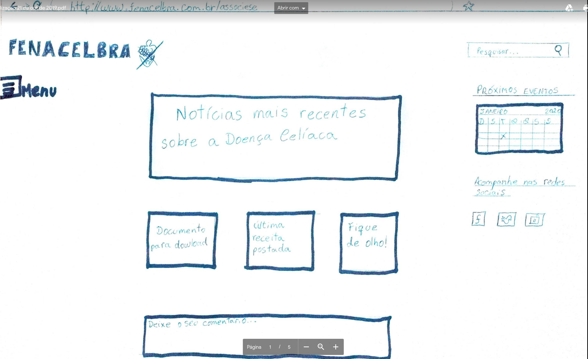

# Protótipo de papel

Este documento consiste na elaboração de um protótipo de baixa fidelidade de papel que registra como deveria ser funcionamento do site FENACELBRA. Com base em relatos reais de usuários, foi possível afirmar que a tarefa foco no site  é realizar o cadastro de usuário, seja ele celíaco ou voluntário, não funciona bem, e deixa o usuário frustrado. Dessa forma, a equipe elaborou um fluxo ideal através do protótipo de papel de como deveria ser o funcionamento do cadastro para os stakeholders.

## Página inicial e menu

## Página de cadastro

No site atualmente não é possível realizar um cadastro eficiente, pois as informações do menu de opções se sobrepõem quando somos direcionados à página de cadastro.

## Videos

Nos vídeos é possível verificar como deveria ser o funcionamento do site FENACELBRA, como seria o fluxo ideal para realizar um cadastro na plataforma através de um protótipo de baixa fidelidade.

<iframe src="https://player.vimeo.com/video/367932289" width="640" height="360" frameborder="0" allowfullscreen></iframe>

<iframe src="https://player.vimeo.com/video/367932458" width="640" height="360" frameborder="0" allowfullscreen></iframe>