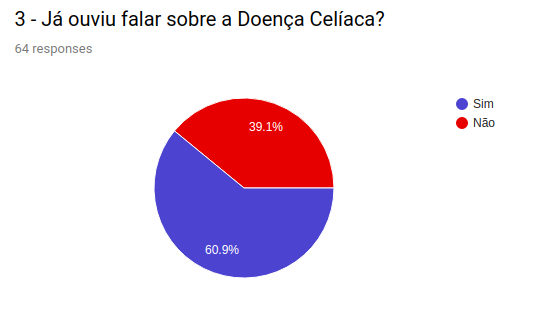
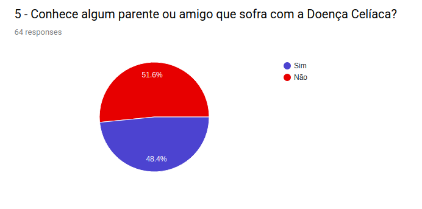

## Questionário

**Questão 01**

**Questão 02**

**Questão 03**

**Questão 04**

**Questão 05**

**Questão 06**

**Questão 07**

**Questão 08**

**Questão 09**

**Questão 10**

**Questão 11**

**Questão 12**

**Questão 13**

**Questão 14**

### Conclusões do questionário:

- Nosso espaço amostral ainda é relativamente pequeno.
- Dificuldade de navegação e layout ruim foram a principais queixas dos usuários.
- Tratamento, informações sobre a doença, e receitas sem glúten foram as principais preferências sobre o que o site deveria ter.
- Apenas ¼ recomendaria o site para um amigo ou familiar conhecer.
- Dos que conheciam o site da FENACELBRA ou acessaram por causa do questionário a maior parte achou ruim ou péssimo.

| Data       | Versão | Descrição                                           | Autor             |
| :--------- | :----- | :-------------------------------------------------- | :---------------- |
| 14/10/2019 | 1.0    | Criação do documento          | Marcos Vinícius   |
| 14/10/2019 | 1.1    | Adicionando questionários tarefas            | Marcos Vinícius   |
| 17/10/2019 | 1.2    | Ajustes na organização da documentação | Nathalia Lorena     |
| 22/10/2019 | 1.3    | Atualização questionários | Marcos Vinícius    |
