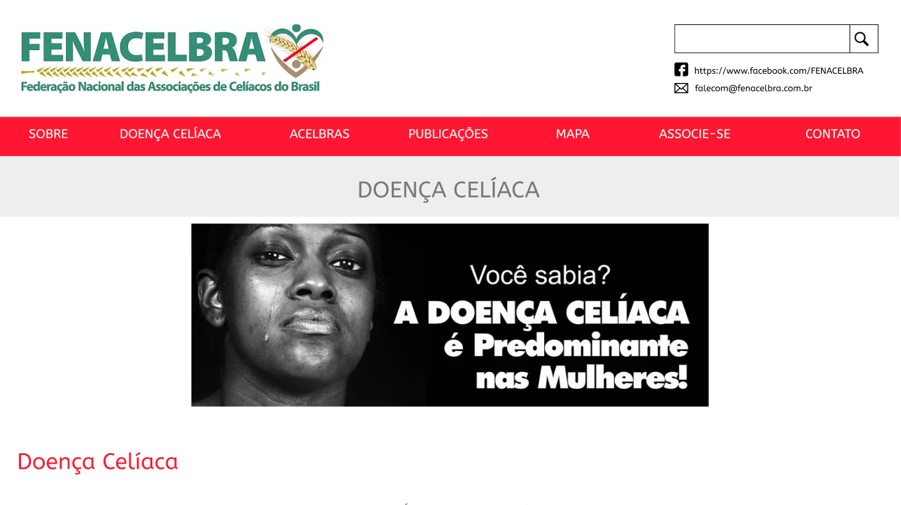

## Protótipo de Alta Fideliadade

### Versão 1.0 Protótipo alta Fidelidade

Página Principal
 

Menu 01
 

Menu 02
 

Informativo 01
 

Informativo 02
 

## Referências

[Site Fenacelbra](http://www.fenacelbra.com.br/fenacelbra/) . Acesso em: 25 de novembro de 2019.

[Software Figma](https://www.figma.com/login) . Acesso em: 25 de novembro de 2019.
## Versionamento

| Data       | Versão | Descrição                              | Autor             |
| :--------- | :----- | :------------------------------------- | :---------------- |
| 28/10/2019 | 1.0    | Iniciando documento                    | Marcos Vinicius |
| 28/10/2019 | 2.0    | Imagens Protótipo alta                    | Marcos Vinicius |
| 25/11/2019 | 2.1    | Ajustando indentação e adicionando versionamento e referências | Débora Vilela     |
