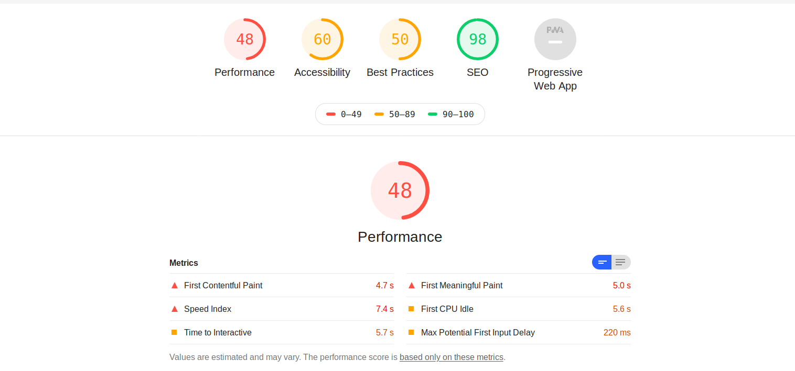

# Avalição LightHouse

O LightHouse é uma ferramenta de avaliação automática para analisar a qualidade de aplicação com base em diversos critérios sendo acessibilidade e perfomance algumas das características avaliadas.

A avaliação completa pode ser conferida neste [link](../assets/fenacelbra_lighthouse.html)

|Data|Versão|Descrição|Autor|
|:--:|:----:|:-------:|:---:|
|24/11/2019|1.0|Criação do documento|Gabriel Tiveron|
